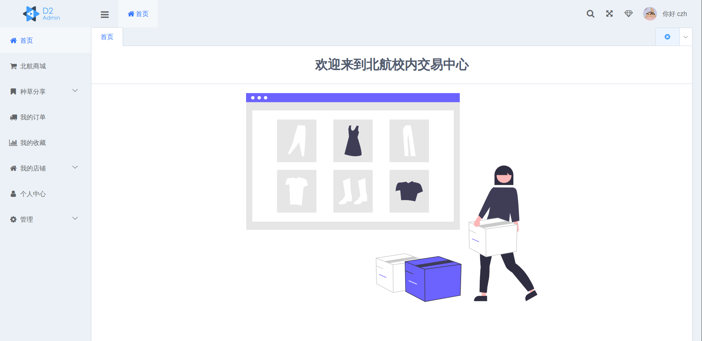
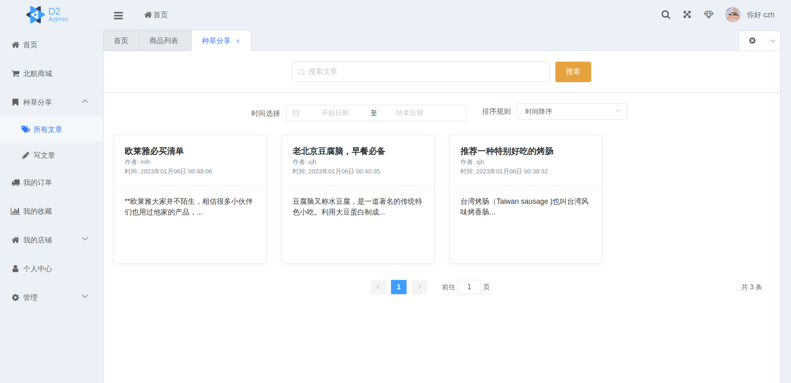
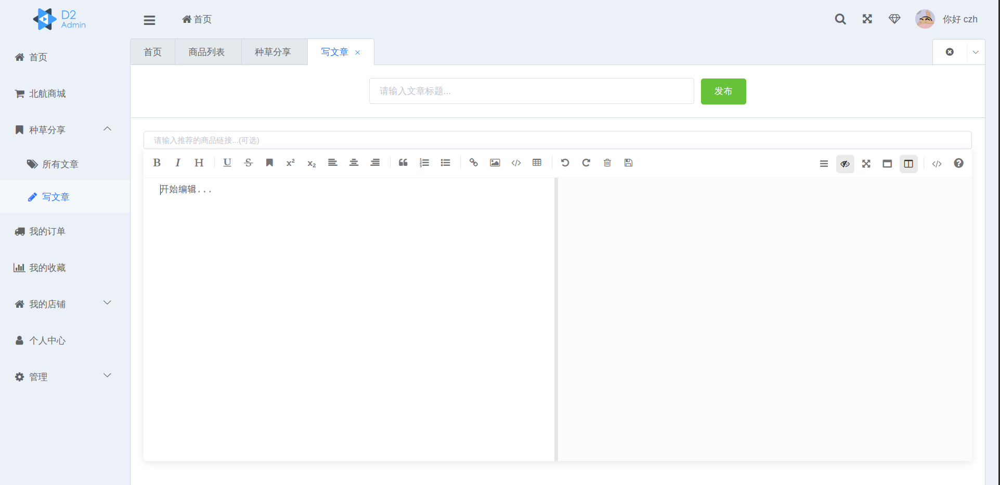
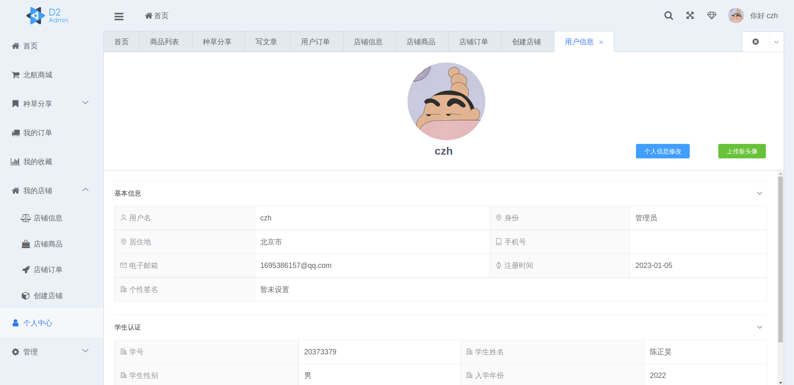

## 北航校内交易中心

### 项目说明

本项目采用了前后端分离开发模式，前端采用Vue2+Element-UI，后端采用Rails实现。该项目实现了一个统一、透明、可靠的校内交易平台。在这个平台上，用户除了能购买商品，也可以通过学生认证进一步成为商家，售卖实体商品、虚拟商品或二手闲置物。同时，该项目还设置了“种草分享”栏目，用户可以发文章推荐自己心仪的商品，店铺也可以发文章为自己代言，更好的满足同学们的各种需求。

### 运行方式

项目包括`frontend`、`backend`两个分支。

`frontend`分支是Vue前端项目。在该分支下，需要通过`npm install`或者`cnpm install`命令安装依赖，然后通过`npm run serve`启动脚手架，最后访问`localhost:8081`即可看到前端效果。如果想要对项目进行编译，可以使用`npm run build`命令，编译好的html、js、css文件会放到dist目录下。

`backend`分支是Rails后端项目。在该分支下，需要先运行下面几个命令对运行环境进行初始化——`bundle install`加载gem包，`rails avtive_storage:install`加载上传图片的功能， `rails db:migrate`创建数据库。之后运行`rails s -b 0.0.0.0`即可启动该项目。如果想要单独测试某个接口，直接按照开发文档中的API使用postman或者curl发起请求即可。另外，我已经提前将前端编译好的文件拷贝到了public文件夹下，直接访问`localhost:3000/`就可以看到最终效果。

### 效果展示

我将该项目部署到aliyun服务器上，访问地址为`http://59.110.234.93:3000`。直接注册默认身份为普通用户，如果想要体验管理员相关功能，可以使用这个账号进行登录——**用户名：czh  密码：123456** 

 

